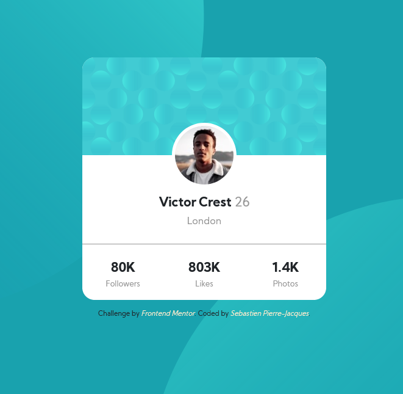

# Frontend Mentor - Profile card component solution

This is a solution to the [Profile card component challenge on Frontend Mentor](https://www.frontendmentor.io/challenges/profile-card-component-cfArpWshJ). Frontend Mentor challenges help you improve your coding skills by building realistic projects. 

## Table of contents

- [Overview](#overview)
  - [The challenge](#the-challenge)
  - [Screenshot](#screenshot)
  - [Links](#links)
- [My process](#my-process)
  - [Built with](#built-with)
  - [What I learned](#what-i-learned)
  - [Continued development](#continued-development)
- [Author](#author)
- [Acknowledgments](#acknowledgments)

## Overview

### The challenge

- Build out the project to the designs provided

### Screenshot

### Links

- Solution URL: [Solution URL](https://www.frontendmentor.io/solutions/profile-card-component-with-bootstrap-aIgpAfn92)
- Live Site URL: [GitHub Live Page](https://sebastienpj.github.io/frontEndMentor-profileCardComponent/)

## My process

### Built with

- HTML5
- CSS
- Bootstrap4

### What I learned

I have been diving deeper into CSS, and solidifying my understanding of the Box Model. This is my first time using viewport units and it was interesting. I will have to play around with them more often. 

To see how you can add code snippets, see below:

### Continued development

Focus Areas:

- Layout and Responsiveness
- Modular Design
- Organizing CSS better

Next projects I will not be using any frameworks.

## Author

- Website - [Sebastien Pierre-Jacques](https://www.linkedin.com/in/sebastien-pierre-jacques/)
- Frontend Mentor - [@SebastienPJ](https://www.frontendmentor.io/profile/SebastienPJ)
- Twitter - [@sebastien_pj](https://twitter.com/sebastien_pj)

## Acknowledgments

I cannot thank the kind people on the FrontendMentor discord. The knowledge shared and guidance offered is priceless.
